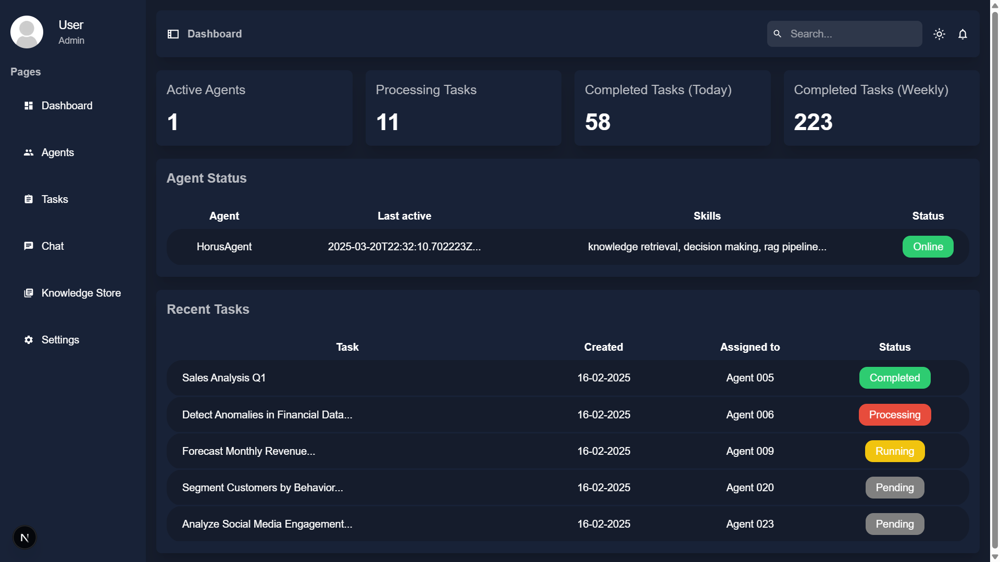

# Horus

## 🔧 Description

**Horus** is an AI infrastructure designed to power secure, collaborative, and self-hosted multi-agent systems. It was built in response to rising concerns about data privacy and lack of control over cloud-based AI tools. Horus enables businesses to integrate AI into their workflow while maintaining full data ownership, supporting agentic AI behaviors, real-time data retrieval, and scalable orchestration of AI agents tailored to enterprise needs.

## 💡 Key Features

* 🔄 **Multi-Agent Collaboration**: Agents work together to analyze, decide, and act in coordination.
* 🔐 **Self-Hosted & Secure**: No external APIs or cloud dependencies; full on-premise support.
* ⚡ **Real-Time Intelligence**: Combines RAG and Agentic AI for instant, context-aware decisions.
* 🧠 **Custom AI Models**: Integrates open-source models (LLaMA, Mistral, Falcon) tailored to business logic.
* 🧩 **Modular & Scalable**: Easily adapts to different industries like e-commerce, cybersecurity, and logistics.

## 🛠️ Tech Stack

* **Languages**: Python, React, C++
* **Frameworks/Technologies**: Docker, RPC/API Queues, Open-Source LLMs (e.g., LLaMA, Falcon), RAG (Retrieval-Augmented Generation), Machine Learning Pipelines
* **Deployment**: Fully self-hosted / Software

## 👨‍💻 My Role

As **Team Manager** and **DevOps Engineer / AI Developer**, I led project coordination, system architecture, and DevOps pipeline implementation. I also contributed to:

* Designing the AI orchestration engine
* Architecting and deploying multi-agent workflows
* Integrating security and privacy features into the system
* Managing internal team communications and milestone delivery

## 📷 Screenshots / Diagrams

*Horus UI MVP*
